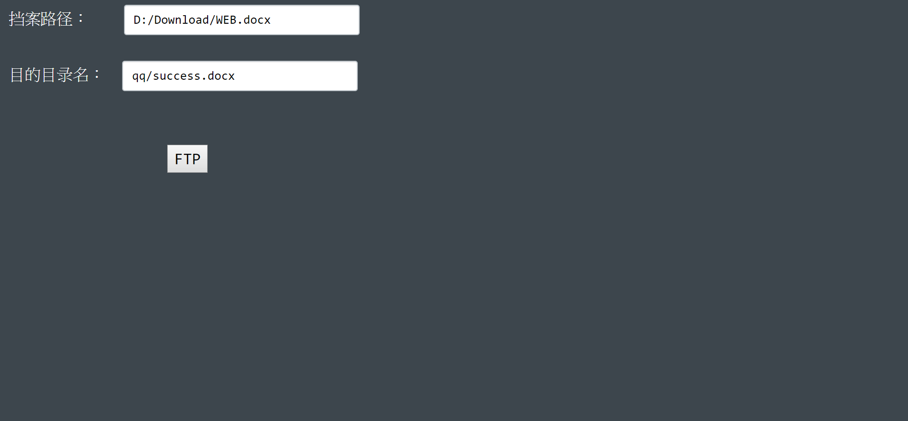

# 本地檔案傳至遠程電腦

 

## 功能
輸入本地文件所在路徑和遠程要存取檔案的路徑，將本地文件上傳到遠程ftp server。  
前端雖然是以上傳文件來設計，但後端仍可對遠程執行刪除文件、刪除目錄、下載、移動和重新命名動作，只需稍微更改前端要input的資料和ajax的type即可。
<i class="fa fa-weixin"></i>

<head> 
     
     
</head> 
<link rel="stylesheet" href="https://use.fontawesome.com/releases/v5.0.13/css/all.css">
